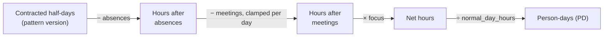
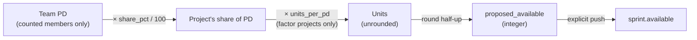

# Capacity

How much work a team, and each of its members, can actually do in a sprint — and
how that turns into the number written on a sprint header. Source of truth:
[`spec/teams.md`](../spec/teams.md) §5–7 and
[ADR 0005](adr/0005-capacity-membership-is-a-flag-not-a-contract-term.md). This
doc explains the implementation; it does not replace the spec.

## TL;DR

- **Team capacity** = for every member, `(contracted hours − absences − meetings) ×
  focus`, summed and divided by the team's `normal_day_hours` to get **person-days
  (PD)**. One member's day can be 6h, another's 8h — PD normalises them onto the
  same scale so they can be added.
- A member can be marked **"doesn't count towards capacity"** (POs, SMs,
  stakeholders). Their own numbers still show, but they're excluded from the team
  total, from every project's share, and from any push.
- Team PD flows into a project as **Available** = `team_PD × share% × units_per_pd`,
  rounded to an integer only at that last step, and only written to a sprint when
  someone explicitly **pushes** it — never automatically.
- This is a **different feature** from the amber/red bar on the PI board
  (`CapacityBar`), which compares story points *used* against a sprint's Available
  *budget*. The two connect only through the push: team capacity computes
  Available, the board bar then measures usage against it.
- Nothing rounds until that last step. Everything upstream — hours, focus,
  person-days, shares — stays float so the displayed hours and days always agree.

---

## Two things both called "capacity"

| | Team capacity engine | Sprint effort bar |
|---|---|---|
| What it answers | How many person-days can this team actually work? | How much of this sprint's point budget is used? |
| Where | Team → Capacity view (`TeamCapacityView.tsx`) | PI board sprint headers (`CapacityBar.tsx`) |
| Inputs | Working pattern, absences, meetings, focus | Sum of PBI/bug effort vs. the sprint's `available` field |
| Output | Person-days (PD), then a project's Available | A percentage and a color (blue/amber/red) |
| Code | `backend/app/services/team_capacity.py` | frontend only, reads `available` off the sprint |

They meet at exactly one point: pushing a team's capacity computes and writes a
sprint's `available` value, which the effort bar then measures against. The rest
of this document is about the first one — the engine — with a short section on
the bar at the end.

---

## The engine, per member

Everything is computed **per half-day** (morning/afternoon), for every day in a
sprint window, for one member at a time:



1. **Contracted half-days.** A member's `MemberPatternVersion` is a dated set of
   14 booleans (`mon_am` … `sun_pm`) plus `hours_per_day` and `focus`. For each
   half-day the version says the member is owed, add `hours_per_day / 2` to
   `contracted_hours`. Versions are dated and half-open — the version in force on
   a given day holds until the next version's `effective_from`, and the earliest
   version extends backwards indefinitely, so no day is ever undefined.
2. **Subtract absences.** If that half-day is covered by an absence, it
   contributes nothing further (`absent_half_days += 1`). Overlapping absences
   union rather than stack — two absences covering the same half-day still cost
   only that one half-day.
3. **Subtract meetings — clamped per day, not per half.** A meeting starts in
   one half and, if it runs longer than that half's remaining hours, spills into
   the day's other half. The day's total is clamped to what's left, so an 8h
   workshop for a 6h/day member costs their whole day and stops at zero — never
   negative. A meeting that starts in an *absent* half costs nothing: absence
   beats meeting.
4. **Apply focus.** `focus` (from the same half-day's pattern version, default
   `1.0`) is applied to whatever survived steps 2–3: `net = (hours − meetings) ×
   focus`. Meetings are subtracted **before** focus, deliberately — meetings are
   booked time the member doesn't have; focus is for the diffuse loss around
   everything else (context switching, interrupts, support duty). Applying focus
   to meeting time too would pay for that overhead twice.
5. **Sum and normalize.** `net_hours = Σ` over every half-day in the window, then
   `person_days = net_hours / normal_day_hours` — the **team's** hours-per-day
   setting, not the member's own. This is what makes person-days comparable
   across members with different contracted hours: an 8h/day and a 6h/day member
   both read in the same unit.

Implementation: [`backend/app/services/team_capacity.py`](../backend/app/services/team_capacity.py)
(`compute_member_capacity`, lines 237–285) — a pure function with no DB access,
so the arithmetic is unit-tested against hand-computed fixtures independently of
the ORM. `compute_team_capacity` (lines 288–315) runs it per member and sums.

### Worked example

Sprint 6–17 Apr 2026 (10 working days), `normal_day_hours = 8.0`:

| | Alice (8h/day, focus 0.8, full-time) | Bob (6h/day, focus 1.0, Mon–Thu + Fri AM) |
|---|---|---|
| Contracted | 20 half-days × 4h = 80.0h | 18 half-days × 3h = 54.0h |
| − absences | 1 day holiday → 72.0h | none → 54.0h |
| − meetings | 2h planning + 1h sync → 69.0h | 2h planning + 2×1h sync → 50.0h |
| × focus | × 0.8 → 55.2h | × 1.0 → 50.0h |
| ÷ 8.0 | **6.9 PD** | **6.3 PD** |

Team: `105.2h / 8.0 = 13.15 PD`, which equals `6.9 + 6.3` (rounded for display) —
the two always agree, because the divisor is shared.

Bob is a good illustration of why **presence and capacity are different
numbers**: he's *present* 9 working days, but contributes 6.3 PD, because his day
is 6h and two of his working days are half-days. The API and UI expose both
(`present_days` vs. `person_days`) rather than conflating them.

Give Bob an 8-hour, full-day workshop instead of his two short meetings, starting
in the morning: it consumes his 3h morning, spills into his 3h afternoon, and
stops there — his day costs 6h, not 8h, and his sprint drops to 44.0h / 5.5 PD.
A per-half clamp would have wrongly billed only 3h and handed back a free
afternoon.

## Who counts towards the team total

Every member's chain above is always computed and shown — but a member has a
`counts_towards_capacity` flag (default `true`), and only members where it's
`true` are added into the team's total, and from there into every project's
share and any push.

This exists for people whose absences matter to the plan but whose hours are not
the team's to spend — a PO, a Scrum Master, a stakeholder. Their holidays and
meetings stay on record (so the team's calendar is complete), but they never
inflate what the team can deliver.

A few things worth knowing about the flag, from
[ADR 0005](adr/0005-capacity-membership-is-a-flag-not-a-contract-term.md):

- It's **undated**, unlike everything else that feeds capacity (which lives on
  the dated pattern version). It describes what kind of row this is, not a
  contract term — it's set once, when the member is added, and almost never
  changes.
- Because it's undated, **flipping it restates every sprint retroactively,
  including closed ones.** If someone's role genuinely changes on a date (PO →
  developer), the correct move is to close the old membership with `active_to`
  and add them again from the next day — not flip the flag.
- It's set only by an explicit action: the add/edit member dialogs, or the MCP
  `create_member` / `update_member` tools. It is never inferred from `role`,
  which stays free text that no calculation reads.
- One engine (`compute_team_capacity`) is shared by the Capacity view, the push
  preview, and the push itself, so they can never disagree about who's counted.

In the UI, every team view (Members, Working days, Absences, Meetings,
Capacity) groups counted members first, then non-counted members below a dashed
rule with a "not counted" chip, and shows a one-line summary such as *"8 members
· 6 count towards capacity · 2 tracked for absences only: Anna (PO), Ben (SM)"*
(`frontend/src/utils/capacityMembers.ts`, `CapacityMembersSummary.tsx`).

## From team person-days to a project's Available

A team can serve several projects, each with its own share:



- `share_pct` (1–100, default 100) — the fraction of the team's capacity assigned
  to this project. Shares across a team's projects may total over 100%; that's
  allowed and only raises an amber over-allocation warning, never a block.
- `available_source`:
  - **`manual`** (default) — Available is typed by hand as always; team capacity
    is shown only as a reference, nothing is derived.
  - **`factor`** — `available = team_PD × share_pct/100 × units_per_pd`, where
    `units_per_pd` is a user-set float (e.g. `1.0` for a project whose unit is
    days, or points-per-day for story points).
  - **`velocity`** — reserved for a future phase; nothing currently writes it.
- **Rounding happens exactly once**, half-up (`Decimal(...).quantize(...,
  ROUND_HALF_UP)` — deliberately *not* Python's `round()`, which rounds `2.5` down
  to `2` via banker's rounding), on the final per-sprint value for `factor`
  projects only. Every sprint rounds independently, so a PI total is the sum of
  the stored integers, not a re-rounded sum of the floats.
- The result is only ever written to `sprint.available` through an **explicit
  push** (`POST /api/v1/teams/{team_id}/push`, previewed via
  `GET/POST /api/v1/projects/{project_id}/team-capacity/preview`) — never as a
  side effect of editing a team or a member, since that write could land in a
  project someone else is holding the edit lock on. Sprints belonging to
  `closed` PIs are never written.

Worked from the example above: 70% share, 1.5 pts/PD →
`13.15 × 0.70 = 9.205 PD`, `9.205 × 1.5 = 13.808` → rounds to **14 pts pushed**.

## API

`GET /api/v1/teams/{team_id}/capacity` returns `TeamCapacityResponse`
([`backend/app/schemas/team_capacity.py`](../backend/app/schemas/team_capacity.py)):

```
TeamCapacityResponse
├── normal_day_hours: float
├── anchor_project_id: str | null      # null ⇒ team serves no project ⇒ no sprint calendar
├── sprints: [CapacitySprint]          # the columns
│     ├── label ("{PI}.{n}"), start_date, end_date
│     └── computable: bool             # false if either date is missing
├── members: [MemberCapacityRow]
│     ├── counts_towards_capacity: bool
│     └── cells: [CapacityBreakdown | null]   # positional, one per sprint
├── team: [CapacityBreakdown | null]   # totals over counting members, per sprint
└── projects: [ProjectCapacityRow]
      ├── share_pct, available_source, units_per_pd
      └── person_days / units / proposed_available: lists, one per sprint
```

`CapacityBreakdown` carries the full chain from the diagram above —
`contracted_half_days`, `contracted_hours`, `absent_half_days`,
`hours_after_absences`, `meeting_hours`, `hours_after_meetings`, `net_hours`,
`person_days`, `present_days` — so any figure in the UI is traceable back to the
inputs that produced it.

A cell is `null`, never `0`, when its sprint is missing a start or end date:
unknown and "no capacity" are different facts, and a `0` would misreport a team
that just hasn't dated a sprint yet as a team with nothing to give.

## Frontend: the Capacity view

`frontend/src/components/TeamCapacityView.tsx` — a table of members × sprints (6
sprint columns per page), with a "Team" total row and, below it, one row per
served project. Non-counted members appear last, dimmed, under a dashed rule.

Each cell (`CapacityCell.tsx`) shows the summary collapsed:

```
6.9 PD
55.2 h
9 d present · 6.9 PD
```

and expands on click into the full chain — contracted → absences → meetings →
focus → ÷ `normal_day_hours` — so a surprising number is always one click from
its explanation. There is deliberately **no bar or color-coding here**: this
view is about how much capacity exists, not about whether it's been used up.

A minimap above the table (`capacityMinimap.ts`) shows, per calendar month,
person-days *lost* to absences and meetings — explicitly excluding focus, since
focus is a standing property of a member's contract rather than something that
happened in a given month. A sprint that straddles a month boundary splits its
loss proportionally.

## The other bar: sprint effort vs. Available

Separately, every sprint header on the PI board shows a thin bar
(`frontend/src/components/CapacityBar.tsx`) comparing **used** effort (the sum of
placed PBI/bug points) against that sprint's **Available** budget — the value the
team-capacity push (above) may have written, or a value typed by hand for
`manual` projects. Color thresholds:

| Condition | Color |
|---|---|
| `available <= 0` and `used > 0` | red — over-committed against no budget |
| `available <= 0` and `used == 0` | gray — nothing set yet |
| `used / available > 1` | red — over capacity |
| `used / available >= 0.85` | amber — near capacity |
| otherwise | blue |

This is the feature described in `spec/specification.md` §11 (Design System);
it has no relationship to `counts_towards_capacity` or to the per-member engine
beyond the fact that a push can populate the number this bar measures against.

## See also

- [`spec/teams.md`](../spec/teams.md) §3 (members, pattern versions), §5
  (capacity computation, the authoritative formula), §6 (projects, shares,
  Available), §7.6 (Capacity view UI spec)
- [ADR 0005](adr/0005-capacity-membership-is-a-flag-not-a-contract-term.md) —
  why `counts_towards_capacity` is undated
- [`backend/app/services/team_capacity.py`](../backend/app/services/team_capacity.py) —
  the pure arithmetic
- [`backend/app/services/team_capacity_report.py`](../backend/app/services/team_capacity_report.py) —
  loads ORM rows and assembles the API response
- [`backend/tests/unit/test_team_capacity.py`](../backend/tests/unit/test_team_capacity.py) —
  the worked examples as tests
